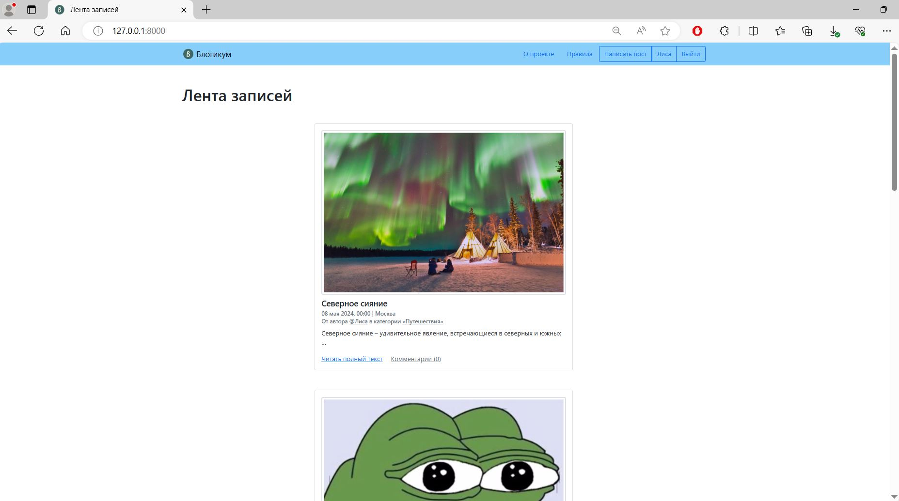

# Проект Blogicum
Проект Blogicum представляет собой соцсеть для ведения блогов, разработанный с использованием фреймворка Django.

<details>
  <summary>Нажмите, чтобы развернуть</summary>
  
</details>

***
## Функционал:
Функционал этого проекта помогает создать мощное и гибкое веб-приложение для социальной сети на базе Django.
### Регистрация и вход под своей учетной записью
Пользователи могут регистрировать учетные записи и входить в систему с помощью логина и пароля.
### Восстановление пароля
Пользователи могут сбросить свой пароль, если забыли его, используя процедуру восстановления.
### Отправка электронных писем
Реализована возможность отправлять электронные уведомления пользователям, например, при сбросе пароля.
### Публикации
Пользователи могут создавать, просматривать, редактировать и удалять свои публикации и просматривать публикации других авторов.
При создании и редактировании публикации можно выбрать из доступных категорию и указать локацию.
### Отложенные публикации
Указав дату публикации «в будущем», можно создавать отложенные посты. Они доступны всем посетителям с момента, указанного в поле «Дата». Отложенные публикации доступны автору сразу же после отправки; автор видит на своей странице все свои публикации, включая отложенные и снятые с публикации администратором.
### Изображения
Пользователи могут прикреплять изображения к своим публикациям для иллюстрации содержания.
### Комментарии
Пользователи могут создавать, просматривать, редактировать, удалять свои комментарии к публикациям и просматривать комментарии других авторов.
### Профиль пользователя
Реализована страница пользователя.

Пользователь может просмотреть:
- информацию о пользователе (доступна всем посетителям),
- публикации пользователя (доступны всем посетителям),
- ссылка на страницу редактирования профиля для изменения имени, фамилии, логина и адреса электронной почты (доступна только залогиненному пользователю — хозяину аккаунта),
- ссылка на страницу изменения пароля (доступна только залогиненному пользователю — хозяину аккаунта).
### Настройки пагинации для публикаций и комментариев
Разбиение длинных списков публикаций и комментариев на отдельные страницы для улучшения удобства пользования.
### Кастомные страницы HTTPResponse ошибок
Подключены и настроены кастомные страницы для отображения информации об ошибках 403 CSRF, 404 и 500 при обращении к веб-приложению.
### Полноценная информативная панель администратора
Администратор может управлять пользователями, публикациями и другими аспектами приложения через удобный интерфейс администратора.
***

## Установка и запуск проекта

### Клонировать репозиторий:
```sh

git clone git@github.com:Valentina-LIS/django_sprint4.git

```

### Перейти в папку проекта:
```sh

cd django_sprint4

```

### Создать виртуальное окружение:
```sh 

python -m venv venv 

``` 

### Активировать виртуальное окружение: 
```sh 

source venv/Scripts/activate

```

### Обновить pip:
```sh 

python -m pip install --upgrade pip

```

### Установить зависимости: 
```sh 

pip install -r requirements.txt

``` 

### Перейти в папку проекта: 
```sh 

cd blogicum

``` 

### Загрузить фикстуры в БД: 
```sh 

python manage.py loaddata db.json

```

### Выполнить миграции: 
```sh 

python manage.py migrate 

```

### Создать суперпользователя:
```sh 

python manage.py createsuperuser 

```

### Запустить проект: 

```sh 

python manage.py runserver 

```

***
Для просмотра главной страницы переходим по адресу `localhost:8000/`

Админ зона находится по адресу `localhost:8000/admin/`, логин и пароль - те, что Вы задавали при создании суперпользователя.
***

# Автор:
Валентина Лисина
